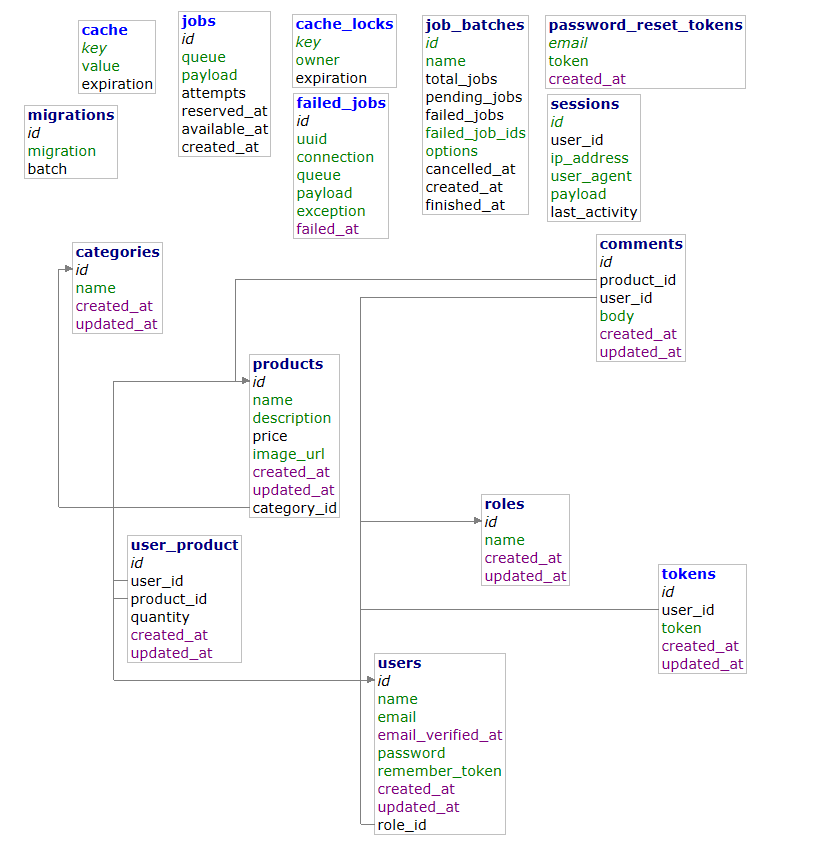
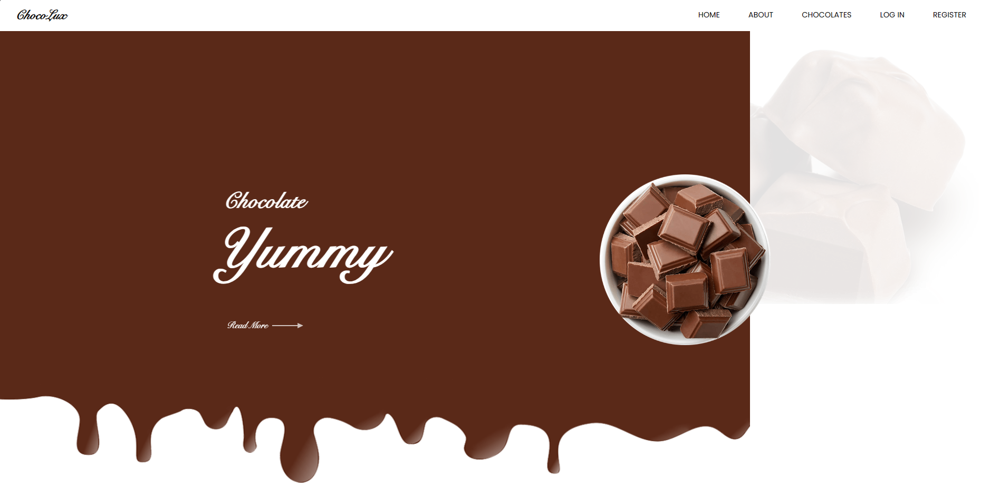
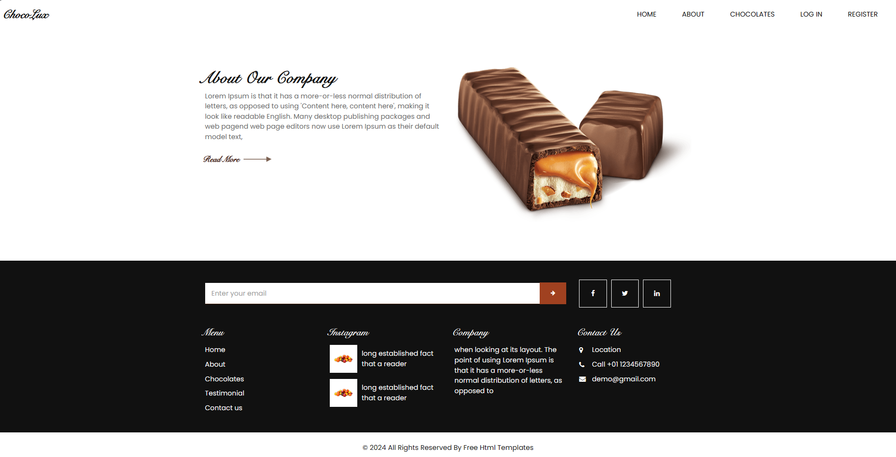
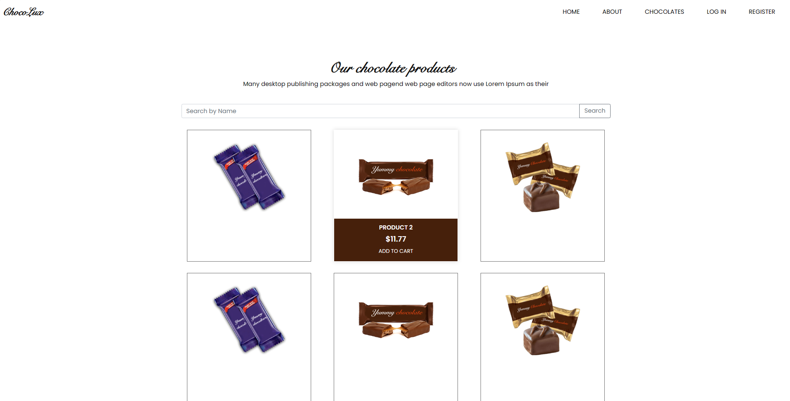
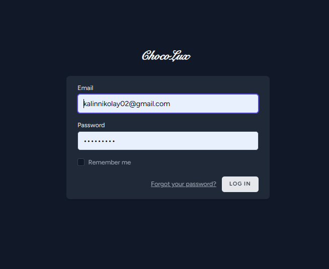
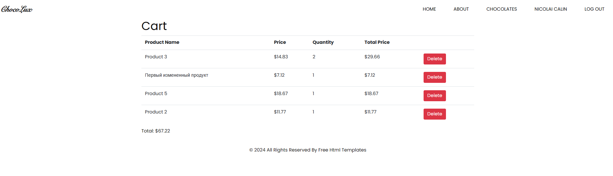
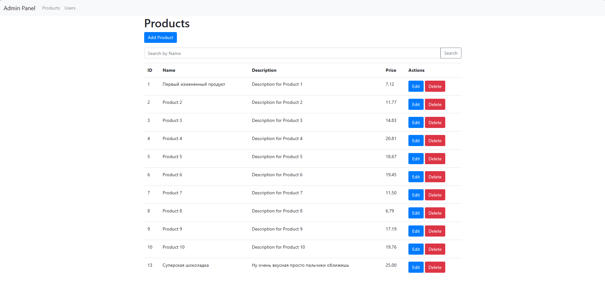
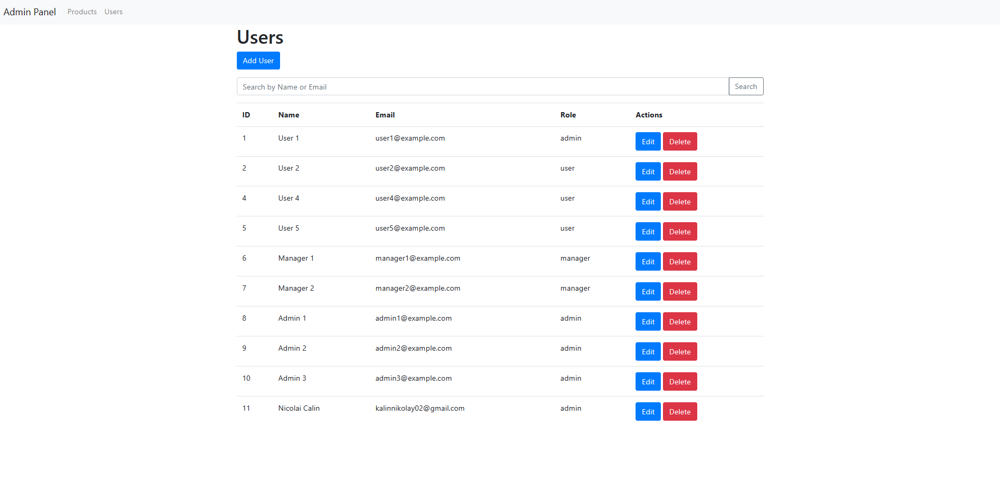

# Отчет по индивидуальной работе

## Инструкция по запуску

1. Клонируйте репозиторий
    ```bash 
    git clone https://github.com/CalinNicolai/PHP-Store   
    ```
2. Откройте проект в вашей среде разработки (например, PhpStorm).
3. Откройте docker Desktop
4. Поднимите базу данных например MariaDB. Для этого выполните команды

    ```bash
    cd .\deploy
    ```

    ```bash
    docker-compose up -d
    ```

5. Перейдите по ссылке [localhost:8080](localhost:8080)
6. Создайте базу данных `choco-shop`
7. Выполните миграции командой

    ```bash
    php artisan migrate
    ```
8. Установите зависимости
   ```bash
   composer install
   ```
   ```bash
   npm isntall
   ```
9. Запустите проект командами
    ```bash
    php artisan serve
    ```
    ```bash
    npm run dev
    ```
10. Для добавления первичных записей в базу данных можно использовать команды
    ```bash
    php artisan db:seed --class=RoleSeeder
    php artisan db:seed --class=UserSeeder
    php artisan db:seed --class=ProductSeeder
    ```
## Описание индивидуальной работы

В данной индивидуальной работе, я разработал веб приложение, темой которой является интернет магазин по продаже изделий
из шоколада.
В работе я использовал такие инструменты как:

1. PHP как основной язык программирования
2. Laravel в качестве framework
3. MariaDB - база данных
4. Bootstrap - как библиотеку стилей, так же вспомогательно TailwindCSS

## Краткая документация к проекту

### Схема базы данных



### Функциональные возможности:

1. Главная страница с информацией о сайте и предложениями.
2. Страница "About" с информацией о компании Choco-lux.
3. Страница с ассортиментом товаров, где пользователи могут просматривать и искать товары по названию.
4. Регистрация и вход для пользователей.
5. Добавление товаров в корзину для авторизованных пользователей.
6. Просмотр корзины и её содержимого.
7. Возможность выхода из аккаунта.
8. Администраторский доступ к /admin/dashboard.
9. Просмотр списка всех товаров, добавление, изменение и удаление товаров администратором.
10. Управление пользователями администратором: создание, просмотр, изменение ролей и удаление пользователей.

### Предполагаемые пользователи:

1. Гости, которые могут просматривать информацию о товарах и компании.
2. Авторизованные пользователи, которые могут добавлять товары в корзину и просматривать её содержимое.
3. Администраторы, которые имеют доступ к административной панели для управления товарами и пользователями.

### Сценарии взаимодействия:

1. Гость заходит на главную страницу, читает информацию и просматривает предложения.
2. Гость переходит на страницу "About" и узнает о компании Choco-lux.
3. Гость переходит на страницу с ассортиментом, просматривает товары и ищет нужный по названию.
4. Гость решает зарегистрироваться, переходит на страницу регистрации, заполняет форму и регистрируется.
5. Зарегистрированный пользователь заходит на сайт, видит своё имя и переходит на страницу с ассортиментом.
6. Пользователь добавляет товары в корзину, просматривает её содержимое, изменяет количество товаров или удаляет их.
7. Пользователь решает выйти из аккаунта, нажимает на кнопку "logout" и выходит.
8. Администратор заходит на сайт, авторизуется и получает доступ к административной панели.
9. Администратор просматривает список всех товаров, добавляет новые, изменяет или удаляет существующие.
10. Администратор переходит на страницу управления пользователями, просматривает список пользователей, изменяет их роли
    или удаляет пользователей.

## Примеры использования проекта

1. Главная страница

   
2. Страница с информацией о компании

   
3. Страница с товарами

   
4. Страница Login

   
5. Страница просмотра и удаления предметов из корзины

   
6. Страница администрирования продуктов

   
7. Страница администрирования пользователей

   

## Список используемых источников

1. https://laravel.com/
2. https://getbootstrap.com/
3. https://www.free-css.com/free-css-templates/page293/chocolux
